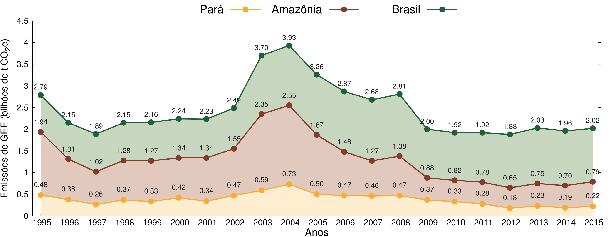
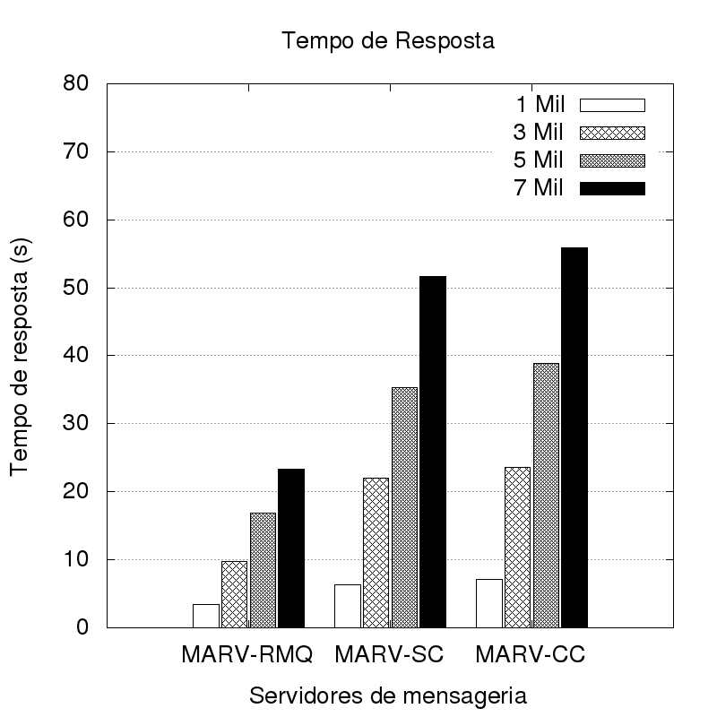
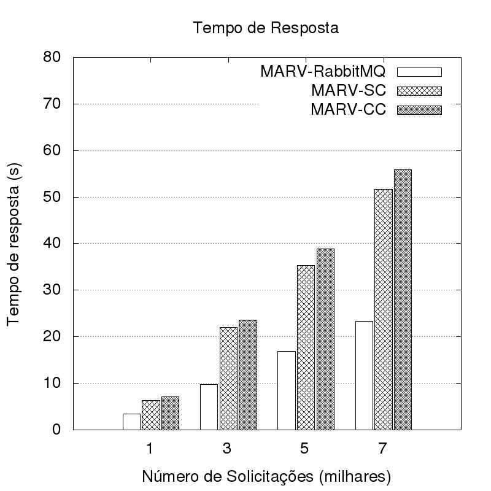

# Plots
Alguns scripts para gerar gráficos de barra e linha em gnuplot

## Gráficos de linha de área

**Gráfico 1. Evolução das emissões brutas de GEE no Brasil, Amazônia e Pará entre 1995 e 2015 em bilhões de toneladas de dióxido de carbono equivalente. Adaptado de: (MOURA R., 2017)**

## Gráfico de barras
 

**Gráfico 2. Tempo de resposta de solicitações do Middleware MARV**

## Referências

> **MOURA, R. 2017** *"[DESMATAMENTO ZERO NO PARÁ: Desafios e Oportunidades. Belém,
Pará](https://imazon.org.br/PDFimazon/Portugues/livros/DesmatamentoZeronoPara.pdf)"* Imazon, 2017. ISBN 978-85-86212-93-2. Disponível em: <>. Acesso em: 3/12/2018.
